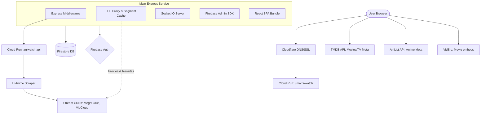
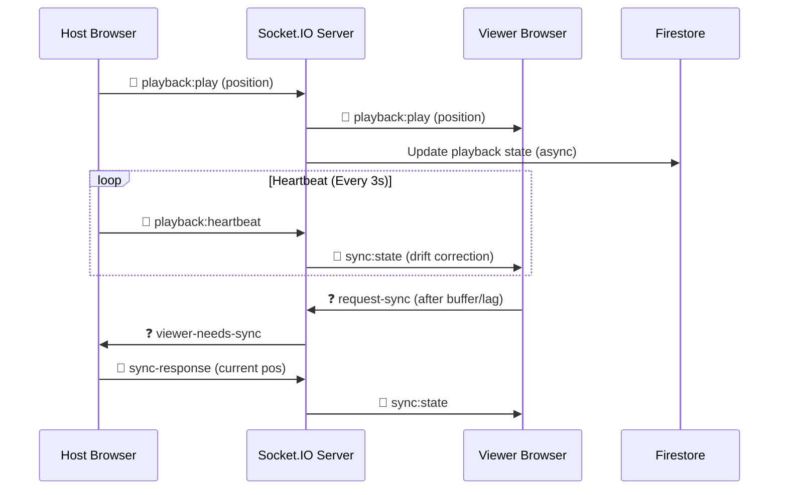

# 🎥 UmamiWatch

A premium, private anime & movies portal with real-time synchronized watch party rooms. Designed for high-performance streaming with minimal infrastructure overhead.

*Created exclusively for Umami Dream precious members by The Boss Lady ©2026*

---

## 🏗️ System Architecture

UmamiWatch is built as a highly-distributed, cloud-native streaming platform. It utilizes a multi-layered proxying system to ensure high availability and bypass CDN restrictions.

### 🌐 System Overview


### ⚡ Real-time Synchronization Flow
UmamiWatch uses a **Distributed Sync Strategy** to ensure all viewers stay within **< 1s** of the host's playback position.



---

## 🔥 Key Features

- **🏯 Anime Portal** — Search and stream thousands of anime via the self-hosted `aniwatch-api` (HiAnime scraper).
- **🎬 Movies & TV** — Metadata provided by TMDB with multiple embed sources (VidSrc CC/Net).
- **🏰 Watch Party Rooms** — Create private rooms with 6-char invite codes.
- **🔄 Sync Playback** — Host-controlled play/pause/seek with automated drift correction for viewers.
- **💬 Live Chat** — Real-time room chat with history persisted in Firestore.
- **📂 Personal Hub** — Continue-watching history, personal watchlist, and custom avatar upload (Base64).
- **🛡️ Bot Protection** — Cloudflare Turnstile integrated at the auth layer.
- **📚 Manga & Comics (Beta)** — Proxied metadata via MangaDex and ComicK with image bypassing.

---

## 🛠️ Technical Deep Dive

### 1. Zero-CORS HLS Proxying
Standard streaming CDNs (MegaCloud, VidCloud) block direct requests from unknown origins via `Referer` and `Origin` headers. UmamiWatch implements a custom **HLS Proxy** in Node.js that:
- **Rewrites Manifests**: Parses `.m3u8` files on-the-fly to redirect all `.ts` segment requests through the backend.
- **Segment Caching**: Implements an in-memory **LRU cache** for video segments to reduce upstream latency and bandwidth during watch parties.
- **Header Injection**: Transparently injects required `Referer` and `Origin` headers to the CDN to bypass CORS blocks.

### 2. Distributed Playback Sync
Synchronization is handled via **Socket.IO** with a specialized drift-correction algorithm:
- **Heartbeat**: The host emits a heartbeat every 3 seconds. Viewers receive this and calculate their drift. If the difference is **> 1 second**, the viewer's player automatically seeks to match the host.
- **State Persistence**: Room playback state is written to Firestore asynchronously, allowing users to resume deep-linked rooms even if the host disconnects.

### 3. Security Model
- **Firebase Admin SDK**: The frontend never talks to Firestore directly. All database operations are proxied through the Express backend, ensuring **zero client-side security rules** are exposed.
- **JWT Auth**: Every API request and socket connection requires a valid Firebase ID token verified server-side.
- **Turnstile Verification**: Cloudflare Turnstile tokens are verified on the server before granting access, effectively blocking automated bot attacks.

---

## 🚀 Tech Stack

| Layer | Technology |
|---|---|
| **Frontend** | React 18, Vite, Tailwind CSS, HLS.js, Video.js |
| **Backend** | Node.js, Express, Socket.IO |
| **Database** | Google Firestore |
| **Auth** | Firebase Authentication |
| **Compute** | Google Cloud Run (Serverless) |
| **Metadata** | TMDB API, AniList GraphQL, MangaDex API |
| **CI/CD** | Cloud Build (Auto-deploy on `git tag`) |

---

## ⚙️ Environment Variables

> [!IMPORTANT]
> All sensitive keys must be stored in **Google Cloud Secret Manager** and never committed to the repository.

### Frontend (`.env.local`)
```bash
VITE_FIREBASE_API_KEY=your_key
VITE_FIREBASE_AUTH_DOMAIN=your_project.firebaseapp.com
VITE_FIREBASE_PROJECT_ID=your_project_id
VITE_FIREBASE_STORAGE_BUCKET=your_project.appspot.com
VITE_TMDB_API_KEY=your_tmdb_key
VITE_TURNSTILE_SITE_KEY=your_cloudflare_site_key
VITE_API_BASE_URL=http://localhost:8080
```

### Backend (`server/.env`)
```bash
GOOGLE_APPLICATION_CREDENTIALS=../firebase-service-account.json
FIREBASE_PROJECT_ID=your_id
FIREBASE_STORAGE_BUCKET=your_bucket
ALLOWED_ORIGINS=http://localhost:5173
ANIWATCH_API_URL=http://localhost:4000
TURNSTILE_SECRET_KEY=your_cloudflare_secret
```

---

## 📦 Deployment (Google Cloud Run)

Deployments are fully automated via **Cloud Build tag triggers**.

1. **Tag your release:**
   ```bash
   git tag v1.0.0
   git push origin v1.0.0
   ```

2. **What happens next?**
   - Cloud Build mirrors the `aniwatch-api` image to your GCR.
   - The main app Docker image is built (baking in build-time VITE_* vars).
   - Both services are deployed to Cloud Run in the specified region.
   - Secrets are automatically mounted at runtime from Secret Manager.

> [!TIP]
> Cloud Run **Session Affinity** must be enabled for the main service to ensure WebSocket stability.

---

*UmamiWatch — Sharing moments, frame by frame.*
