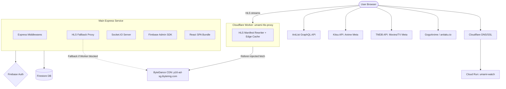
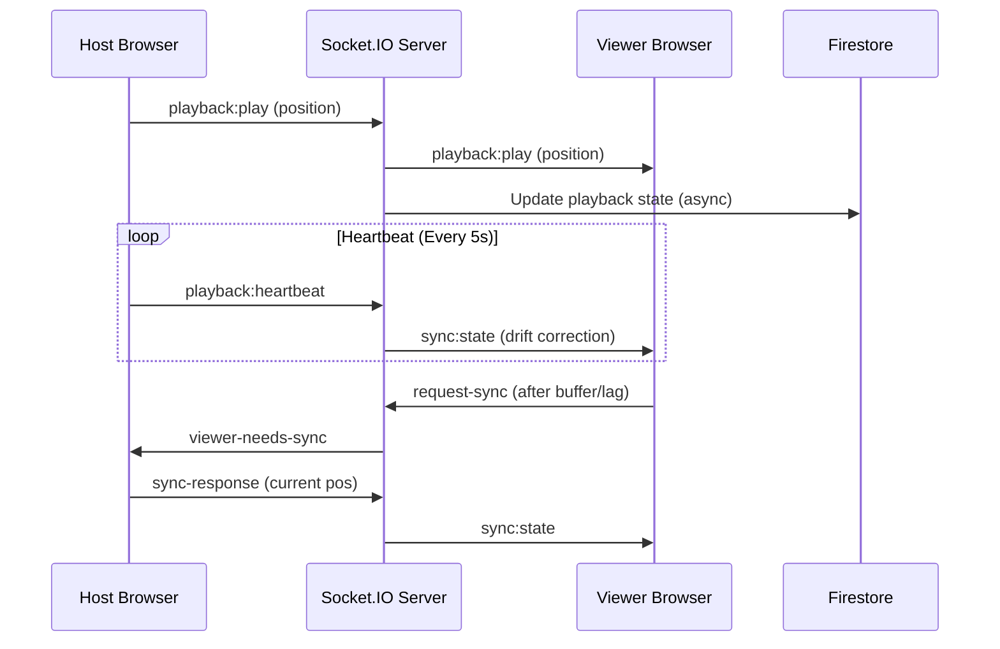

# UmamiWatch

A premium, private anime & movies portal with real-time synchronized watch party rooms. Designed for high-performance streaming with minimal infrastructure overhead.

*Created exclusively for Umami Dream precious members by The Boss Lady ©2026*

---

## System Architecture

UmamiWatch is built as a cloud-native streaming platform. It uses a multi-layered proxying system to ensure availability and bypass CDN restrictions, with video bandwidth routed through Cloudflare Workers to eliminate Cloud Run egress costs.

### System Overview


### Real-time Synchronization Flow
UmamiWatch uses a **Distributed Sync Strategy** to ensure all viewers stay within a few seconds of the host's playback position.



---

## Key Features

- **Anime Portal** — Search and stream anime via GogoAnime (anitaku.to) with HLS delivery through Cloudflare Worker.
- **Movies & TV** — Metadata via TMDB, playback via VidLink iframe embed.
- **Watch Party Rooms** — Create private rooms; host picks the episode and all viewers sync in real-time.
- **Sync Playback** — Host-controlled play/pause/seek with automated drift correction for viewers (anime/HLS only).
- **Live Chat** — Real-time room chat with GIF support, history persisted in Firestore.
- **Personal Hub** — Continue-watching history, personal watchlist, and custom avatar upload.
- **Bot Protection** — Cloudflare Turnstile integrated at the auth layer.

---

## Technical Deep Dive

### 1. Anime Streaming via GogoAnime

Anime streams are sourced from **GogoAnime** (`anitaku.to`). The server scrapes episode pages to extract a vibeplayer embed ID, then constructs an HLS URL at `vibeplayer.site/public/stream/{id}/master.m3u8`.

Why GogoAnime:
- No CAPTCHA, no token decryption, freely scrapable server-side.
- Video segments are served by **ByteDance CDN** (`p16-ad-sg.ibyteimg.com`) which has no IP restrictions — the Cloudflare Worker can fetch them freely, meaning zero video egress through Cloud Run.

### 2.  Worker Proxy (Zero Cloud Run Egress for Video)

All HLS bandwidth is routed through the **Cloudflare Worker** (`umami-hls-proxy`) instead of Cloud Run, eliminating video egress charges entirely:

- **HLS path** — The Worker rewrites `.m3u8` manifests so all segment URLs point back through itself. Segments are cached at the Cloudflare edge (1h TTL), meaning watch party members sharing an episode hit cache after the first viewer loads each segment.
- **Fallback** — Cloud Run retains an `/api/proxy/hls` fallback for cases where the Worker's IP range gets blocked by a CDN.

A ~400MB episode stream generates **zero Cloud Run egress charges**.

### 3. Movies & TV Streaming

Movies and TV shows use **VidLink** (`vidlink.pro`) iframe embeds. No server-side stream extraction is performed — the client builds the embed URL directly from the TMDB ID. Because the player lives in a cross-origin iframe, automatic playback sync in watch parties is not supported; rooms show an informational notice and members start playback manually.

### 4. Distributed Playback Sync

Synchronization is handled via **Socket.IO** with a drift-correction algorithm:
- **Heartbeat** — The host emits a heartbeat every 5 seconds containing current position and play state. If a viewer's position differs by more than **6 seconds**, their player automatically seeks to match the host.
- **On-demand sync** — Viewers emit `request-sync` every 20 seconds; the server routes it to the host socket which responds with the current position immediately.
- **State Persistence** — Room playback state is written to Firestore asynchronously, allowing users to resume rooms even if the host disconnects.

### 5. Security Model

- **Firebase Admin SDK** — All database operations go through the Express backend. The frontend has no direct Firestore write access.
- **JWT Auth** — Every API request and socket connection requires a valid Firebase ID token verified server-side.
- **Turnstile Verification** — Cloudflare Turnstile tokens are verified on the server before granting access.

---

## Tech Stack

| Layer | Technology |
|---|---|
| **Frontend** | React 18, Vite, Tailwind CSS, Plyr, HLS.js |
| **Backend** | Node.js, Express, Socket.IO |
| **Database** | Google Firestore |
| **Auth** | Firebase Authentication |
| **Compute** | Google Cloud Run (Serverless) |
| **Video Proxy** |  Worker (free egress) |
| **Anime Source** | GogoAnime / anitaku.to (server-side scrape) |
| **Anime Metadata** | Kitsu API + AniList GraphQL |
| **Movie/TV Metadata** | TMDB API |
| **Movie/TV Playback** | VidLink iframe embed |
| **CI/CD** | Cloud Build (auto-deploy on `git tag`) |

---

## Environment Variables

> [!IMPORTANT]
> All sensitive keys must be stored in **Google Cloud Secret Manager** and never committed to the repository.

### Frontend (`.env`)
```bash
VITE_FIREBASE_API_KEY=your_key
VITE_FIREBASE_AUTH_DOMAIN=your_project.firebaseapp.com
VITE_FIREBASE_PROJECT_ID=your_project_id
VITE_FIREBASE_STORAGE_BUCKET=your_project.appspot.com
VITE_TMDB_API_KEY=your_tmdb_key
VITE_TURNSTILE_SITE_KEY=your_cloudflare_site_key
VITE_API_BASE_URL=http://localhost:8080
VITE_HLS_PROXY_URL=https://umami-hls-proxy.<subdomain>.workers.dev
```

### Backend (`server/.env`)
```bash
GOOGLE_APPLICATION_CREDENTIALS=../firebase-service-account.json
FIREBASE_PROJECT_ID=your_id
FIREBASE_STORAGE_BUCKET=your_bucket
ALLOWED_ORIGINS=http://localhost:5173
TURNSTILE_SECRET_KEY=your_cloudflare_secret
```

---

## Deployment

Deployments are fully automated via **Cloud Build tag triggers**.

1. **Tag your release:**
   ```bash
   git tag v1.0.0
   git push origin v1.0.0
   ```

2. **What happens:**
   - The main app Docker image is built with Vite build-time vars baked in.
   - The image is deployed to Cloud Run with secrets mounted from Secret Manager.

3. **Cloudflare Worker** — Deploy `cloudflare-worker/hls-proxy.js` separately via the Cloudflare dashboard or `wrangler deploy`. The Worker handles HLS proxying and must be redeployed independently of Cloud Run.

> [!TIP]
> Cloud Run **Session Affinity** must be enabled for the main service to ensure WebSocket stability.

---

*UmamiWatch — Sharing moments, frame by frame.*
